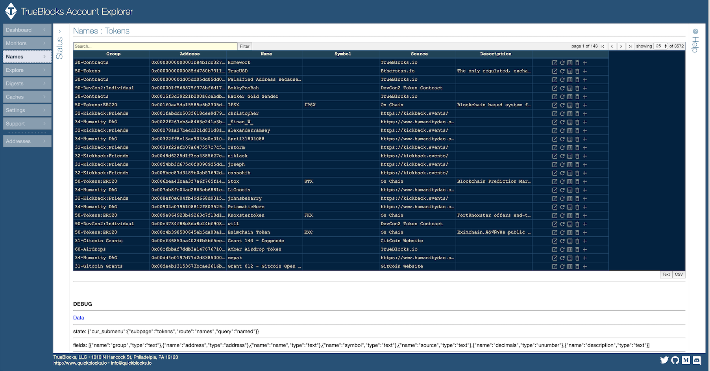

# TrueBlocks Account Explorer


[](https://quickblocks.io/)
[](https://github.com/Great-Hill-Corporation/trueblocks-explorer)
[](https://reactjs.org/)
[](https://twitter.com/quickblocks?lang=es)

The TrueBlocks system creates an index of on-chain appearances of Ethereum addresses on commerial grade hardware, providing fast access to 'everything that ever happened' to the addresses. This enables, for the first time ever, a fully decentralized blockchain browsing experience -- and this translates directly into privacy-preserving browsing.

----

## Installation

### Installing TrueBlocks Core and Core Applications

Download and install the **trueblocks-core** repo. First you need to setup your build environment. Do that by following the instructions for your operating system on this page: [Installation Instructions](https://github.com/Great-Hill-Corporation/trueblocks-core/blob/master/src/other/install/INSTALL.md). Summarizing:

```
git clone https://github.com/Great-Hill-Corporation/trueblocks-core
cd trueblocks-core
mkdir build && cd build
cmake ../src
make
```

Before proceeding, add the TrueBlocks `./bin` folder to your **$PATH** (i.e `./trueblocks/core/bin`).

----

### Installing the User Interface, API, and Documentation

Once you've installed the core, you may install the user interface, the api (which requires data from the core), and the documentation server. All of this is contained in a single repo (this one). From your development folder:

```
git clone https://github.com/Great-Hill-Corporation/trueblocks-explorer
cd trueblocks-explorer
yarn global add foreman
yarn install
nf start
```

Your should see the **TrueBlocks Account Explorer** screen.



## Requirements

- **Note:** In order for the TrueBlocks Explorer to work, you must have access to a Parity Ethereum node with **--tracing** enabled. TrueBlocks defaults to using the RPC endpoint at http://localhost:8545, but you may use any endpoint (Infura, Quiknodes, for example). Performance will be *greatly* reduced if you're not running your own local node. A good solution is to run a node on the dAppNode or Ava.do platforms and use [http://gtihub.com/Great-Hill-Corporation](the TrueBlocks docker image).

## Getting Data on the Command Line

Assuming that you've installed TrueBlocks correctly and that you have an available node endpoint, and the executables are in your $PATH, you should be able to run this command from a terminal window:

```
chifra blocks 100
```

and get valid data from your node:

```
{
  "data": [
    {
      "gasLimit": 5000,
      "gasUsed": 0,
      "hash": "0xdfe2e70d6c116a541101cecbb256d7402d62125f6ddc9b607d49edc989825c64",
      "blockNumber": 100,
      "parentHash": "0xdb10afd3efa45327eb284c83cc925bd9bd7966aea53067c1eebe0724d124ec1e",
      "miner": "0xbb7b8287f3f0a933474a79eae42cbca977791171",
      "difficulty": 17916437174,
      "price": 0,
      "finalized": true,
      "timestamp": 1438270443,
      "transactions": []
    }
  ]
}
```

If that works, try this command:

```
chifra blocks 0-latest

or

chifra blocks 0-latest:10000 (for export only every 10,000th block)
```

There are many other options to `chifra`. See the docs.

## Getting Data from the API

The TrueBlocks Explorer uses an API to access data provided by the core. Assuming everything is installed correctly, you should be able to use the same API to deliver data to your dApp:

```
open http://localhost:8090/docs
```

For documentation on the API. The same commands are available through the API as are available through `chifra` on the command line. The API runs at `http://localhost:8080` by default.

Examples:

- Get all JSON exported for specific address:
    - `curl http://localhost/export?address=0xfB6916095ca1df60bB79Ce92cE3Ea74c37c5d359`

- Get `{blockNumber, txIndex}` appearances for specific address: `curl http://localhost/list?address=0xfB6916095ca1df60bB79Ce92cE3Ea74c37c5d359`


## FAQ

### I'm running geth, do I need to run Parity instead?

Yes - Parity delivers the necessary articulated traces so that TrueBlocks can build its address index. We don't yet support Geth.

### More coming soon...


## Troubleshooting

## Contributing

Please read [CONTRIBUTING.md](CONTRIBUTING.md) for details on our code of conduct, and the process for submitting pull requests to us.

## Authors

* **Thomas Jay Rush** - [tjayrush](https://github.com/tjayrush)
* **Ed Mazurek** - [wildmolasses](https://github.com/wildmolasses)

See also the list of [contributors](https://github.com/Great-Hill-Corporation/trueblocks-docker/contributors) who participated in this project.

## License

Licensing information pending...

## References

